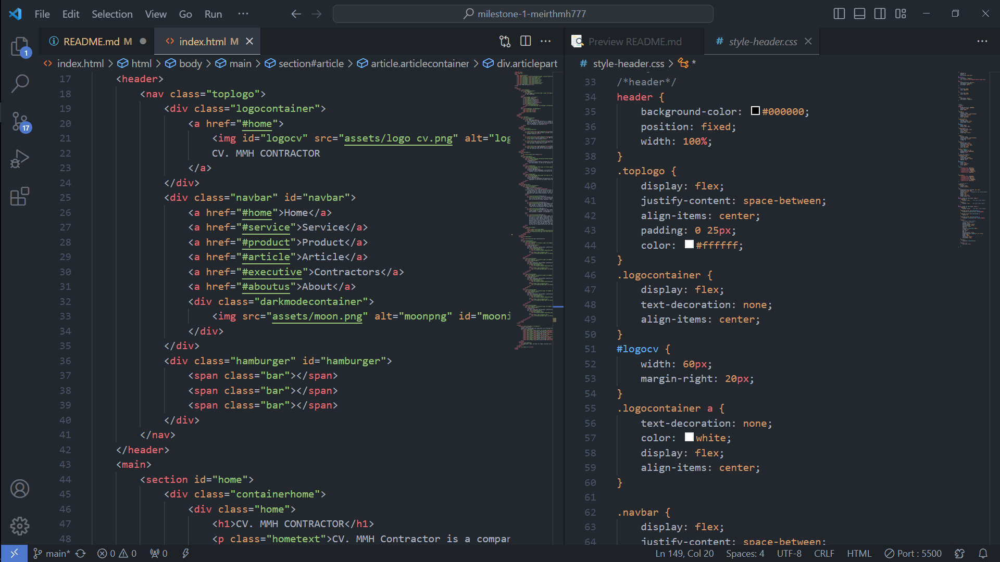
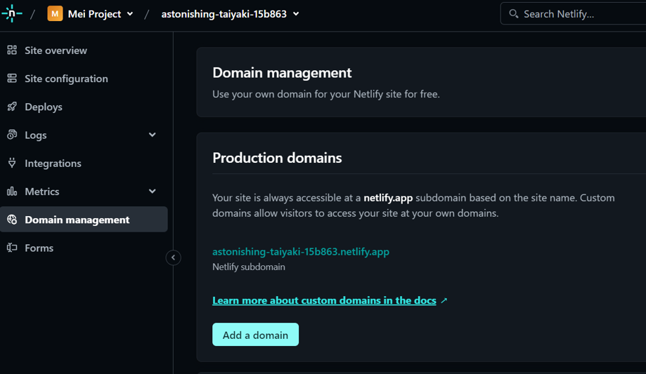

# Documentation of Milestone 1
## Getting The Idea
Creating an idea for a company profile website. Here I createsd a contractor company profile that work in civil engineer field. 

### About CV. MMH Contractor
Access to our website project in the links below:
- Vercel app: https://milestone-1-meirthmh777.vercel.app/
- Netlify app : https://spareshop.shop/
- New domain : https://spareshop.shop/

### Project Description
CV. MMH Contractor is a company operating in the road pavement sector. This company offers orders for ready mix asphalt as well as mixing materials for road pavement structures, namely coarse aggregate and fine aggregate. In providing materials and planning the CV mix design. MMH Contractor is also equipped with a mix design test laboratory.

-----------------------------------------------

------------------------------------------------
## 0. Cloning File to New Repository of Github
Already have the ne Github repository and in here I just clone the previous project and make new project.
Here I will place the repository in my document folder in my computer. 
- Open Gitbash here and git clone paste the link https:// from the repository.

- Copy the previous project and paste it into the new folder created by the Gitbash.
- Then open Gitbash here in the new folder created by the Gitbash. Then do
- git add .
- git commit -m "your message"
- git push

Now I can change the file based on my needs in this new project.

-------------------------------------------

## 1. Semantic HTML and CSS Styling
### 1.1 Create HTML file and CSS Files
Create HTML file in the vscode with <!DOCTYPE html>. Because I need a clear and detailed description for my project, that's why I also worked on the CSS for styling this new project. I worked both of HTML and CSS gradually so I have clear ideas for "what's next?". To make it even easier, I create every section design into different CSS files that connected with HTML file.

In this webtise the readers can read with different mode. My project website has two theme there are light mode as the main mode and dark mode. It is up to the readers based on theis needs and my consideration to make it as flexible as possible for the readers. For enable the dark mode I use Javascript.

This website also using '@media only screen' as media query to make it responsive in any size of viewprot. There are screen max-width 768px for tablet viewport and max-width 400px for mobile viewport.

### 1.2 Create Header
I created the navigation bar and short description of the company in the header part.
in the navigation bar I use tag nav with the class of '.navbar' for grouping every link using tag 'a' on top of th screen and make it stick on top.

Beside that I use Javascript aslo to make the hamburger enable in min-width 768px.

### 1.3 Create Main 
My main part consists of several sections and using tag 'section'. Generally it consists of these sections.

#### 1.3.1 Section Home
In the section home provides the company profile. So the readers can easily unsderstand what is the company name and what field does the company work generally. Use tag 'h1' for the company name and tag "p' for the paragraph part.
In the description I use rgba background and custom the font color to make the company short description easier to read.

#### 1.3.2 Section Service
Section service describes what kind of services in the company provides. In this section I use the unordered list tag 'ul' to make every services in the company structured and the readers can easly read and understand.

#### 1.3.3 Section Product
Section service describes what kind of products in the company also sell. In this section I use grid to design to explain the details of every product the company provides. with tag 'div' and give class in every div create the design with picture above the description so the customers can understand what jind of product that the copany provides to sell.

#### 1.3.4 Section Article
Section article with tag 'article' provides a mini article for the readers to read in a short time. So the readers also have some knowledge based on the company field and make the company looks more professional on their own field by giving some information about the article. 
I use 'srcset' in the tag 'picture' so the images can change in three screen width. There are more than 768px and less than 768px. The readers can see different pictures in different screen width.

#### 1.3.5 Section Contractor
Section of cotractors has a little bit different sructure and tyle from the product section. This section provides the readers to get to know more about the contractors that work in the company. Using tag 'img' to provide picture profile of every contractors and giving the description which consists name and years of experience for every contractors work.
The readers can get to know more the experience of each contractors by click the Linkedin and Instagram button under the contractors profile.

### 1.4 Create Footer
I create 'footer' consists of two sections. 

#### 1.4.1 Section Rating
I create this rating stars because I want to know my readers about my website appearance. even though it doesn't have localStorage yet.
This section created to make it easy for readers who want to send a rating especially about the website design.
Background color of this section can change because it has background-color :var(--) in the CSS style-footer file based on which mode the readers choose.

#### 1.4.2 Section Copyright
So the readers know who creates the website and the owner. it has brighter color and use black color for the font.

---------------------------------------------
## 2. How to Deploy The Web Project
### 2.1 Connect Github Repository to Netlify
- Go to the Netlify project, in Sites section choose add new site and import an existing project.

- Choose which repository you want to connect with Netlfy.

- Deploy the repository, wait until the process done and your project ready to open use the Netlify site.

### 2.2 Add Custom Domain to Netlify DNS
- In you project site of Netlify click left tab '

- In the Production domains click Add a domain

- Add your domain and verify. You can follow for the next step.

--------------------------------------------

----------------------------------------------

# The Author
## Meirth Maulida Hartanti
> _**Freedom** is already within you._

### My Links
- Linkedin: [meirthmh](https://www.linkedin.com/in/meirth-maulida-hartanti-241a1b183/)
- Instagram: [meirthmh](https://instagram.com/meirthmh/)

### My Skills
- Speak and write in English
- Speak and write in Mandarin (HSK 2)
- Civil Engineer Applications (Autocad, SketchUp, Vray, Civil 3D, Infraworks, Staadpro, etc.)
- Newbie of Software Engineer 